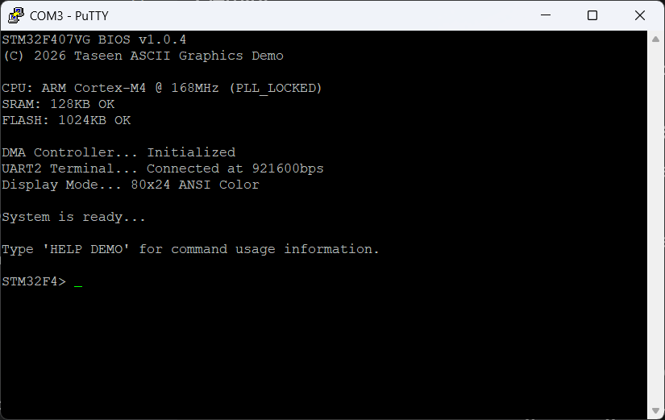

# How to Use the Shell

The Shell is a command-line interface for the STM32F4 ASCII Graphics Demo. This terminal-based environment can run the demo program, access help, and switch between modes and scenes from the terminal.

It uses OpenVMS-style command syntax, which is clear and predictable. This means commands follow a familiar structure that resembles vintage VT100 terminals.

## What Is the Shell?

The Shell serves as a text-based command interpreter, functioning as the primary user interface for the STM32F4 system. System capabilities include:

* **Execute programs** using the `RUN` command
* **Access help documentation** using the `HELP` command
* **Navigate to different application modes** (Dashboard, Auto Scene, Playlist)
* **Select specific scenes** directly from the command line

### Key Features

* **Case-insensitive input**: Commands can be typed in uppercase, lowercase, or mixed case
* **VMS-style error messages**: Clear, error reporting
* **Interactive prompts**: The shell displays `STM32F4>` as the input prompt
* **System boot sequence**: Shows hardware initialization status on startup
* **Flexible command parsing**: Supports optional qualifiers and parameters

## Understanding Command Format

The Shell uses **OpenVMS-style command syntax**, a command-line interface standard known for clarity and consistency. This section explains the grammar for constructing commands.

### Command Syntax Structure

The Shell parser follows this consistent syntax hierarchy, inherited from OpenVMS conventions:

Each element serves a specific purpose:

* **COMMAND**: The primary action (e.g., `RUN`, `HELP`)
* **TOPIC**: The target of the command (e.g., `DEMO`, the program to run or help topic)
* **QUALIFIER**: Optional modifiers that refine behaviour, always prefixed with `/` (e.g., `/MODE=AUTO`)

**Example Breakdown:**

```shell
RUN         DEMO          /MODE=AUTO
│           │             │
COMMAND     TOPIC         QUALIFIER
```

### Qualifier Formats

Qualifiers are optional parameters that modify command behaviour. They follow the format `/QUALIFIER=VALUE`:

| Qualifier | Valid Values        | Example              |
|-----------|---------------------|----------------------|
| `/MODE`   | `AUTO`, `PLAYLIST`  | `/MODE=AUTO`         |
| `/SCENE`  | Scene identifiers   | `/SCENE=MATRIX_RAIN` |

**Key Points:**

* Qualifiers are **optional** (commands work without them)
* Qualifiers are **case-insensitive** like commands
* Multiple qualifiers could theoretically be used, but the current Shell supports one per command
* The `=` sign is required when providing a value

## Entering Shell Mode

The Shell environment initializes as the default operating state upon system boot or following the termination of any active scene or dashboard process.

### Boot Sequence

Upon Shell initialization, the terminal displays the boot sequence line by line. Once a line appears, an artificial delay occurs before the system renders the subsequent line to mimic an old computing experience.



### Ready to Accept Input

Once the `STM32F4>` appears, it signals that the shell is ready to accept commands. The cursor becomes visible and is positioned after the system prompt, waiting for user input.

## Available Commands

### 1. **RUN Command**

Executes a program or application module.

**Basic Syntax:**

```shell
RUN [program] [qualifier]
```

**Available Programs:**

* `DEMO` - The main ASCII graphics demonstration application

**Qualifiers for DEMO:**

* `/MODE=AUTO` - Runs the demo in automatic mode (cycles through all scenes)
* `/MODE=PLAYLIST` - Runs the demo in playlist mode (curated scene selection)
* `/SCENE=name` - Launches a specific scene directly (advanced usage)

### 2. **HELP Command**

Displays help documentation for available commands and features.

**Basic Syntax:**

```shell
HELP [topic] [qualifier]
```

**Available Topics:**

* `RUN` - Help about the RUN command and available programs
* `DEMO` - Help about the DEMO program and its modes
* `DEMO /MODE` - Detailed information about AUTO and PLAYLIST modes
* `DEMO /SCENE` - Information about launching specific scenes

## Command Syntax and Examples

### RUN Command Examples

#### Example 1: Launch Demo in Playlist Mode (Default)

```shell
STM32F4> RUN DEMO
```

This launches the demo application in **Playlist mode** by default (if no mode qualifier is specified).

**Result:** The dashboard displays the Playlist option highlighted, ready for selection.

---

#### Example 2: Launch Demo in Auto Mode

```shell
STM32F4> RUN DEMO /MODE=AUTO
```

This launches the demo application in **Auto mode**, which automatically cycles through all available scenes.

**Result:** The dashboard displays the Auto option highlighted, with scenes rotating automatically.

---

#### Example 3: Launch Demo in Playlist Mode (Explicit)

```shell
STM32F4> RUN DEMO /MODE=PLAYLIST
```

This explicitly launches the demo in **Playlist mode**.

**Result:** Same as Example 1 (default behaviour).

---

#### Example 4: Invalid Command

```shell
STM32F4> RUN GRAPHICS
```

This attempts to run an invalid program.

**Error Message:**

```shell
%HELP-E-UNKNOWNTOPIC, no documentation available for that topic
STM32F4>
```

### HELP Command Examples

#### Example 1: Get Help on RUN Command

```shell
STM32F4> HELP RUN
```

**Output:**

```shell
RUN
 
  Starts the execution of a specified program.
  Qualifiers may be appended to modify execution behavior.
 
  Format:  RUN [program name] [/QUALIFIER=...]
 
Additional information available:
 
  DEMO
 
STM32F4>
```

---

#### Example 2: Get Help on DEMO Program

```shell
STM32F4> HELP DEMO
```

**Output:**

```shell
DEMO
 
  Invokes the DEMO program showcasing various scenes
  and graphics capabilities of the system.
 
  Format:  RUN DEMO [/MODE=type or /SCENE=name]
 
Additional information available:
 
  /MODE      /SCENE
 
STM32F4>
```

---

#### Example 3: Get Help on DEMO Modes

```shell
STM32F4> HELP DEMO /MODE
```

**Output:**

```shell
DEMO
  /MODE
 
    /Mode=name
    Specifies the playback behavior for the DEMO program.
 
    Valid modes are:
      AUTO      Displays every scene sequentially at set intervals.
      PLAYLIST  Plays a curated list of specific scenes back-to-back.
 
STM32F4>
```

---

#### Example 4: Get Help on Scene Selection

```shell
STM32F4> HELP DEMO /SCENE
```

**Output:**

```shell
DEMO
  /SCENE
 
    /SCENE=name
    Specifies the graphics scene to launch immediately, bypassing
    the interactive dashboard menu.
 
STM32F4>
```

## Navigation Logic

### System States and Flow

The application operates in four distinct states, controlled through the Shell and other interfaces:

```likec4-view project=stm32f4-ascii-graphics-demo browser=true dynamic-variant=diagram
systemModeStateMachine
```

## Error Handling

The Shell provides comprehensive error messages following VMS-style conventions. Errors are displayed in **red text** for visibility.

### Error Types and Messages

#### 1. **Unknown Command**

```shell
STM32F4> FLY DEMO
 
%SYSTEM-E-UNRECOGNIZED, command not found
```

**Cause:** The command entered is not recognized (e.g., "FLY" instead of "RUN")

**Solution:** Use `HELP` to see available commands

---

#### 2. **Missing Topic**

```shell
STM32F4> HELP
 
%HELP-E-NOTOPIC, please specify a help topic (e.g., HELP DEMO)
```

**Cause:** The HELP command was entered without specifying a topic

**Solution:** Specify a topic: `HELP DEMO`, `HELP RUN`, etc.

---

#### 3. **Unknown Topic**

```shell
STM32F4> HELP GRAPHICS
 
%HELP-E-UNKNOWNTOPIC, no documentation available for that topic
```

**Cause:** The specified topic does not exist in the help system

**Solution:** Use valid topics: `RUN`, `DEMO`, `DEMO /MODE`, `DEMO /SCENE`

---

#### 4. **Unknown Qualifier**

```shell
STM32F4> RUN DEMO /MODE=TURBO
 
%SYSTEM-E-INVQUAL, unrecognized qualifier in command string
```

**Cause:** An invalid qualifier or qualifier value was provided

**Solution:** Use valid qualifiers: `/MODE=AUTO` or `/MODE=PLAYLIST`

---

#### 5. **Invalid Parameter**

```shell
STM32F4> RUN DEMO /SPEED=100
 
%SYSTEM-E-INVPARAM, invalid parameter value provided
```

**Cause:** The parameter value is outside acceptable range or invalid

**Solution:** Check command syntax with `HELP DEMO`

## Command Input Tips

### Case Sensitivity

The Shell is **case-insensitive**. All of these are equivalent:

```shell
RUN DEMO
run demo
Run Demo
rUN dEmO
```

### Spacing

Commands are space-delimited. Proper spacing is important:

```shell
✓ RUN DEMO /MODE=AUTO     (correct)
✗ RUNDEMO/MODE=AUTO       (incorrect)
✗ RUN  DEMO /MODE=AUTO    (acceptable - extra spaces are ignored)
```

### Input Correction

To correct a typing error, the user must press the **BACKSPACE** key to remove the incorrect characters. Once the terminal prompt displays the intended command and the cursor is positioned at the end of the correct string, the user presses the **ENTER** key to submit the input.

```shell
STM32F4> HELP DEMP        (typed wrong)
STM32F4> HELP DEMO        (backspace used, now correct)
```

## Troubleshooting

### Shell Not Responding

Ensure serial connection is active at 921600 bps. The system requires proper UART2 configuration.

### Command Not Recognized

Check for typos and proper spacing. Use `HELP` to verify command syntax.

### Cannot Exit Scene Mode

Allow all scenes to complete. The application automatically returns to Shell mode when scenes finish.

### Jumbled Characters

Verify terminal emulator is set to support ANSI colour codes and UTF-8 encoding.
