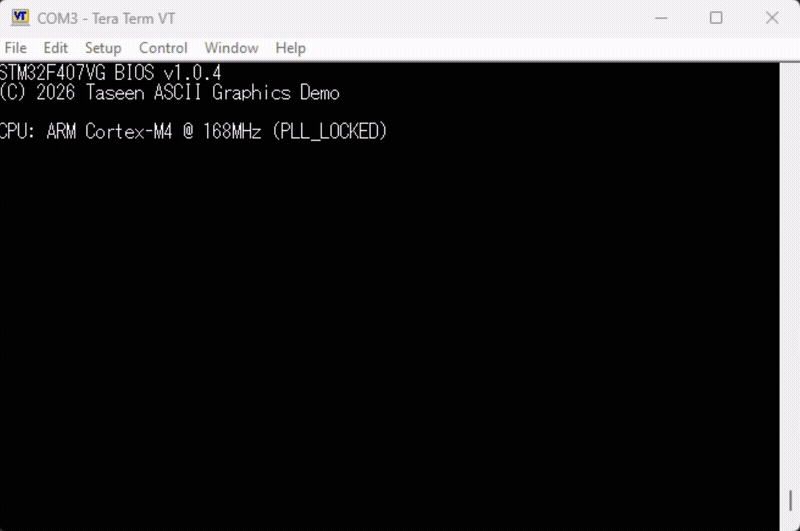
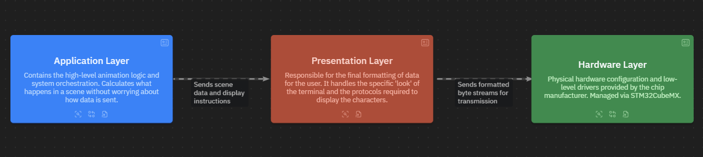

# STM32F4 ASCII Graphics Demo

[](https://www.st.com/en/evaluation-tools/stm32f4discovery.html)

[](https://code.visualstudio.com/)
[](LICENSE)

> Real-time ASCII art demo scenes rendered on a PC terminal over a high-speed UART link, running bare-metal on the STM32F407 Discovery board.



## Overview

Inspired by the ASCII BB demo showcasing a constrained machine, a continuous multi-scene loop could produce something worth watching. This project applies that same philosophy using the STM32F4 Discovery kit.

The primary objective is to use a standard serial terminal as a visual canvas. Running at 921,600 baud on an ARM Cortex-M4, the software renders animated scenes while a CLI shell or orchestrates play back control.

### Objectives

From the beginning, the project was designed with the following core objectives in mind:

- **Hardware Abstraction** - Separating the application-level graphics logic from the low-level register configuration maximizing modularity and maintainability.
- **Non-Blocking Data Flow** - Using Direct Memory Access (DMA) for UART transmissions. Offloading data transfers to DMA. Allows the CPU to calculate the next frame immediately rather than wasting cycles waiting for peripheral registers to clear.
- **Glitch-Free Frame Transitions** - Writing a state machine to control screen changes making sure frame timing is consistent and prevents flickering or tearing during scene transitions.
- **Fast Math Execution** - Using the ARM Cortex-M4 Floating Point Unit (FPU) to handle real-time calculations and coordinate transformations efficiently.
- **Technical Documentation** - Documenting the codebase with architectural references, step-by-step guides, and setup tutorials to simplify future development and maintenance.

### Development Phases

The project progresses through the following four phases, with detailed milestones for each tracked in the project planning documentation:

1. **Establishing high-speed communication** - Set up a fast, direct data link between the microcontroller and the PC so information transfers quickly in the background without slowing down the processor.
1. **Building visual rendering engines** - Write the math and logic to draw 2D animations and 3D shapes, converting brightness and depth into text characters on the screen.
1. **Implementing playback control** - Create a central controller and timer to automatically switch between different scenes at a smooth, constant frame rate.
1. **Optimizing performance** - Speed up the code by using fixed-point math and reducing data transmission so the entire demo runs without lagging or stuttering.

## Features

The software combines multiple key features to achieve smooth, real-time ASCII graphics rendering at high baud rates.

- **High-speed UART** — Configured at a baud rate of 921,600 baud (the highest speed supported by the STM32F4 microcontroller) to provide an effective throughput ceiling of 92,160 bytes per second for animation data.
- **Transmission Control** - Implements a choice between full-screen DMA-backed non-blocking transfers to free the CPU during complete screen refreshes, and direct blocking print execution for highly optimized, sparse coordinate updates.
- **Hardware RNG** — Generates a unique starting seed using the built-in TRNG of the STM32F4, which is then expanded via the fast Xorshift software algorithm to calculate random numbers quickly for use in visual effects and animations.
- **ANSI/VT100 support** — Complete escape sequence implementation for cursor positioning, color, attributes (bold, underline, inverse), and graphics primitives.
- **Scene manager** — Auto and playlist playback modes with configurable durations and transition effects between scenes.
- **CLI shell** — OpenVMS-style command interface (`RUN DEMO /MODE=AUTO`, `HELP DEMO`, etc.) for interactive playback control and system inspection.
- **Interactive dashboard** — Boot menu with blinking selection highlight and real-time FPS display for mode selection.

## Architecture

The firmware uses a layered architecture to separate concerns between application logic, terminal formatting, and hardware control. This design maintains clear boundaries and allows each layer to evolve independently without affecting the others.

### The 3-Tiered Structure

The firmware implements a strict 3-Tiered Architecture designed to decouple high-level application logic from the low-level physical layers of the STM32F4 microcontroller.



#### Application Layer

The Application Layer controls the high-level logic, system orchestration, and user interaction. It manages the active playback modes, visual animations, and user inputs via the CLI shell and dashboard. This layer calculates all state changes and scene timing independently, keeping the core logic completely separated from how data is physically sent to the hardware.

#### Presentation Layer

The Presentation Layer translates raw animation data into formatted instructions for the terminal software. It uses ANSI/VT100 escape sequences to handle cursor positioning, styling, and color, using both direct streaming and double-buffered rendering. This layer packages these formatted streams into serial packets, converting the graphical instructions into raw bytes for the hardware.

#### Hardware Layer

The Hardware Layer works directly with the physical chip and handles the vendor setup files. This layer configures all internal peripherals, manages the low-level hardware initialization, and runs the main firmware loop. The vendor's library then handles the exact register changes, separating the rest of the application from the specific chip design.

### Project Structure

The directory layout mirrors the 3-Tiered Architecture to enforce separation at the filesystem level.

- `App/` directory contains the high-level animation logic, ASCII rendering, and ANSI formatting entirely free from hardware dependencies.
- The `Core/` and `Drivers/` directories restrict CubeMX initialization, STM32 HAL, and CMSIS code strictly to low-level hardware interaction.
- `Docs/` maintains all user and technical documentation as the source for the MkDocs documentation site.

```shell
stm32f4-ascii-graphics-demo/
├── .github/                # GitHub Actions / CI workflows
│
├── App/                    # High-level application logic (ASCII engine)
│   ├── Inc/                # Application header files
│   │   └── Scenes/         # Header files for individual animation scenes
│   ├── Src/                # Application source files
│   │   └── Scenes/         # Source files for individual animation scenes
│   └── CMakeLists.txt      # Subdirectory build configuration
│
├── Core/                   # Main loop, interrupts, and HAL initialization
├── Drivers/                # CMSIS and STM32 HAL Drivers
├── Middlewares/            # Specialized stacks (RTOS, FatFS, etc.)
├── USB_HOST/               # USB Host stack configuration
│
├── Docs/                   # Documentation Source
│   ├── Assets/             # Images, diagrams, and static media
│   ├── Explanation/        # Design philosophy and deep-dives
│   ├── How-to/             # Goal-oriented guides
│   ├── LikeC4/             # Architecture-as-code diagrams
│   ├── Reference/          # Technical specs and API details
│   ├── Tutorial/           # Learning-oriented lessons
│   ├── Doxyfile            # Doxygen configuration
│   └── index.md            # Documentation landing page
│
├── .clang-format           # Code style configuration
├── .clang-tidy             # Static analysis rules
├── .clangd                 # Language server configuration
│
├── CMakeLists.txt          # Primary build script
├── CMakePresets.json       # Build configuration presets
├── mkdocs.yml              # Documentation site configuration
├── README.md               # Project overview
│
├── stm32f4-ascii-graphics-demo.ioc  # CubeMX Hardware Configuration
```

## Development & Quality

The project enforces code quality through automated analysis and formatting tools during development, and maintains a clean separation between application code and vendor-provided hardware drivers during testing.

### Code Quality & Security

The codebase is maintained using automated linting and formatting tools to ensure consistency and catch common embedded C pitfalls:

- **Static Analysis:** Deep analysis via **Clang-Tidy** using `bugprone-*`, `portability-*`, and `clang-analyzer-*` checks. Logic and bugprone checks are enforced as **WarningsAsErrors**.
- **Code Formatting:** Consistent style and layout enforced via **Clang-Format** using a customized Microsoft-based configuration.
- **Exclusion Rules:** Auto-generated-HAL code, peripheral drivers, middleware stacks, and IDE configurations (e.g., `Drivers/`, `Core/`, `Middlewares/`, `USB_HOST/`, `STM32CubeIDE/`) are explicitly excluded from analysis to focus on the integrity of the application and scene logic.

### Development & Tooling

The project uses a modern embedded C toolchain with automated quality checks and documentation generation.

- **Build system:** CMake with STM32CubeMX hardware configuration
- **Code analysis:** Clang-Tidy with bugprone and portability checks enforced as warnings
- **Code formatting:** Clang-Format with Microsoft-based style configuration
- **IDE support:** VS Code with STM32CubeIDE extension for flashing and debugging
- **Terminal output**: PuTTY or Tera Term acting as the visual rendering canvas
- **Documentation:** Doxygen for API reference, MkDocs with Material theme for guides, LikeC4 for architecture diagrams

## Documentation

The complete documentation is structured into four separate quadrants following the **Diátaxis** framework, ensuring clear separation of technical details:

1. **Tutorials:** Learning-oriented lessons to get up and running with the board configuration.
1. **How-To Guides:** Goal-oriented, step-by-step instructions to perform specific tasks, such as creating and registering a completely new scene.
1. **Reference:** Technical specification tables, ANSI byte-overhead budgets, and raw UART bandwidth equations.
1. **Explanation:** High-level discussions regarding architecture-as-code models (LikeC4) and memory optimization logic.

> To view the full details, visit the official page: [Read the Documentation Site](https://taseenk.github.io/stm32f4-ascii-graphics-demo/)

## Acknowledgments & Inspiration

This project draws directly from earlier concepts and visual techniques. The listed sources provided the foundational inspiration used to develop the demo scenes.

- [ASCII AA Project BB Demo YouTube video](https://youtu.be/FLlDt_4EGX4?si=c_ntV8wBtghTJN6d): Main Inspiration for the project
- [Mirror repository of the BB demo by denisse-dev](https://github.com/denisse-dev/bb): The function layout in this repository inspired the decision to split scenes into separate files and sequential function calls for building scenes.
- [OpenVMS Operating System](https://vmssoftware.com/): The command syntax and qualifier structure inspired the creation of the interactive CLI shell used for playback control and system inspection.
- [VT100 ASCII Animation TortureTest YouTube video](https://youtu.be/4ZeDudfzAs0?si=S6oy03UdSebeTyBo): Inspiration for Attributes demo scene
- [ANSI Code Generator repository](https://github.com/fidian/ansi): Inspiration for the xterm palette scene.

## License

This project is open-source and available under the terms of the **MIT License**.

The software can be copied, modified, merged, published, or distributed without restriction, provided that the original copyright notice and permission notice are included in all copies or substantial portions of the software.

> **Note on Hardware Drivers:** This project links STMicroelectronics HAL drivers (`Drivers/` folder) which retain their original **BSD 3-Clause** licensing terms.
